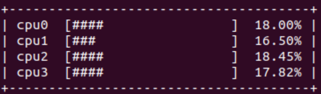
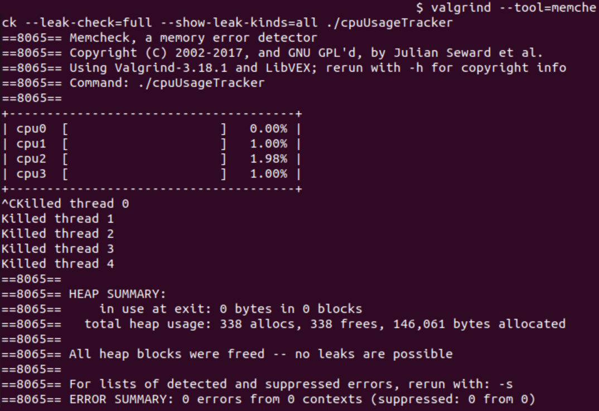

# CPU-Usage-Tracker

An implementation of a simple multi-threaded console application that monitors current percentage CPU usage.

### Compilation:
```ps
$ make # compile executable using gcc compiler
$ make CC=clang # compile executable using clang compiler
$ make test # compile testing executable
```
### Running:
```bash
$ ./cpuUsageTracker
$ ./cpuUsageTrackerTest
```

### Description
The threads and their functions are as follows:

- _Reader_ - reads the contents of /proc/stat and saves them into a global array - buffer, to be sent to _Analyzer_,
- _Analyzer_ - reads raw data from buffer, formats it, calculates the percentage usage for each CPU core and saves that data into a global structure object - buffer to _Printer_,
- _Printer_ - reads data from buffer and displays it in the console every second,
- _Watchdog_ - monitors the previous 3 threads and shuts down the process if any of them stop working for more than 2 seconds,
- _Logger_ - saves information useful for debugging into a log text file.
<p align="justify">
The synchronization between threads is achieved using mutexes, conditional variables and signals. Every second <em>Printer</em> sends a signal to <em>Reader</em> to inform it, that new data is needed. <em>Reader</em> performs its operations, sends a signal to <em>Analyzer</em> and "goes to sleep" using _pthread_cond_wait()_ function.
<em>Analyzer</em> "wakes up", performs its operations and sends a signal to <em>Printer</em>, that the data is available. Then it also goes to sleep. Finally, <em>Printer</em> accesses the data, prints it out in the console and goes to sleep for the remainder of 1 second interval, calculated from the moment it sent signal to <em>Reader</em>.
All of the threads set up flags at the start of their every iteration, to inform the <em>Watchdog</em>, that they are indeed still working. <em>Watchdog</em> monitors these flags every 2 seconds and in case of 1 or more threads not responding for that time interval, it sends a <em>sigterm</em> signal, to shut down the whole process. In case there were no errors during initialization period and one of the threads just stopped working abruptly, the <em>Watchdog</em> also tries to pinpoint the exact thread, based on the oldest flag notification.
All the while the <em>Logger</em> collects messages from each thread, via a message-queue structure and saves them in a log file. These messages are both connected to threads informing that they finished their operations for current iteration and any errors that they encountered. To ensure that every message is documented, the <em>Logger</em> is the last thread to shut down, only when message queue is empty.
</p>

<p align="justify">
The code can be compiled using both gcc and clang. For gcc compilation flags are: -Wall and -Wextra. For clang: -Weverything and -Wno-declaration-after-statement (to ignore <strong>mixing declaration and code is incompatible with standards before C99</strong> warnings, since the program was supposed to be written in C99 or newer standard).
</p>

### Printing
<p align="justify">
In the console, each of CPU cores has its own line, in which it displays its name and percentage usage in both graphical manner and as a percentage value:
</p>



### Logging
<p align="justify">
At the start of each program's instance, a new log text file is created in **logs** folder, that should be present in program's root directory.
</p>

```log
22:33:55	Reader: /proc/stat raw data read and sent
22:33:55	Analyzer: CPU percentage usage data calculated
22:33:55	Printer: CPU usage percentage data received and printed
22:33:55	Analyzer: CPU percentage usage data sent to printer
22:33:56	Reader: /proc/stat raw data read and sent
22:33:56	Analyzer: CPU percentage usage data calculated
22:33:56	Printer: CPU usage percentage data received and printed
22:33:56	Analyzer: CPU percentage usage data sent to printer
22:33:57	Reader: /proc/stat raw data read and sent
22:33:57	Analyzer: CPU percentage usage data calculated
22:33:57	Printer: CPU usage percentage data received and printed
22:33:57	Analyzer: CPU percentage usage data sent to printer
22:33:58	Reader: /proc/stat raw data read and sent
22:33:58	Analyzer: CPU percentage usage data calculated
22:33:58	Printer: CPU usage percentage data received and printed
22:33:58	Analyzer: CPU percentage usage data sent to printer
22:33:59	Reader: /proc/stat raw data read and sent
22:33:59	Analyzer: CPU percentage usage data calculated
22:33:59	Printer: CPU usage percentage data received and printed
22:33:59	Analyzer: CPU percentage usage data sent to printer
22:34:00	Reader: /proc/stat raw data read and sent
22:34:00	Analyzer: CPU percentage usage data calculated
22:34:00	Printer: CPU usage percentage data received and printed
22:34:00	Analyzer: CPU percentage usage data sent to printer
22:34:01	*** SIGTERM signal caught - killing all threads
```
### Memory management
During implementation, the program was tested for potential memory management errors and threading bugs using **valgrind**:

